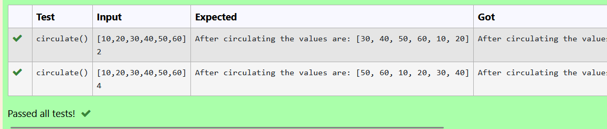

# Circulate-the-values-of-N-variables
## Aim:
To write a python program to circulate the n variables using function concept
## Equipment’s required:
PC
Anaconda - Python 3.7
## Algorithm: 
### Step 1:
first step is to define the function
### Step 2:
get a,n inputs from the user
### Step 5:
define the formula step
### Step 4:
print the result
## Program:
```python
#Program to circulate N values.
#Developed by: Tamizhselvan.R
#RegisterNumber:22002952
def circulate():
    l=eval(input())
    n=int(input())
    l=l[n:]+l[:n]
    print("After circulating the values are:",l)
 ```   

## Output:


## Result:
By this program we able to circulate the values of n variables
